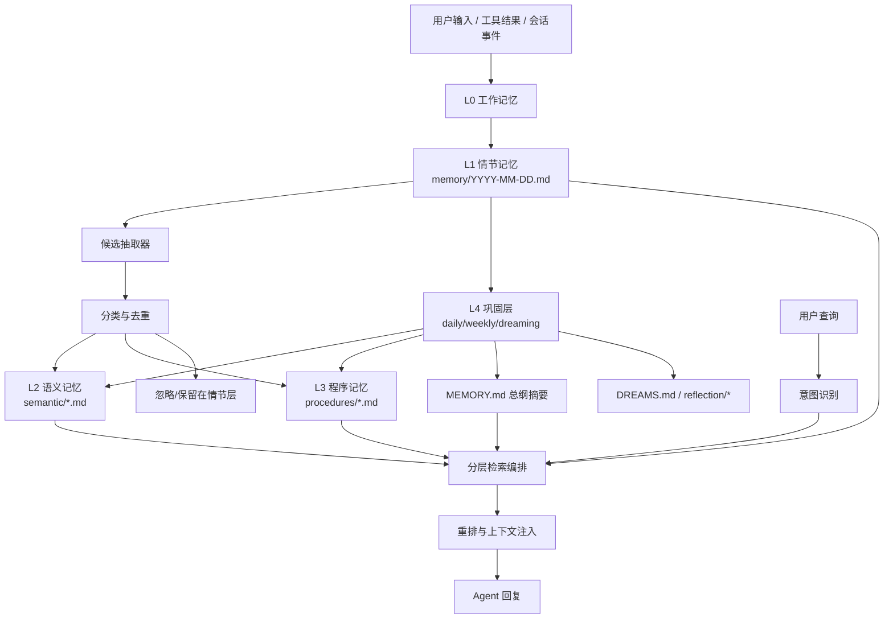
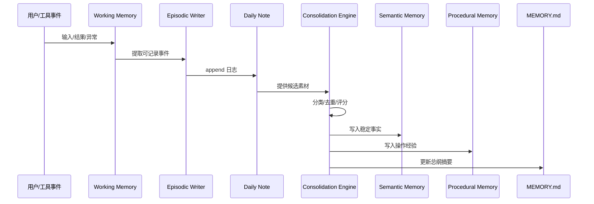
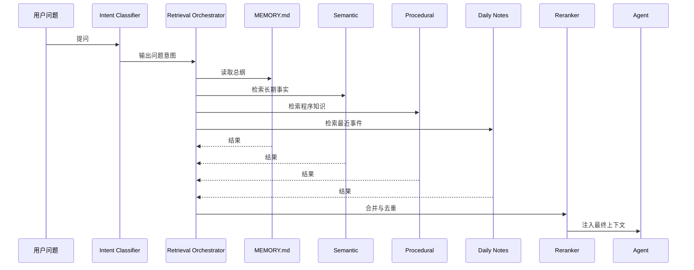
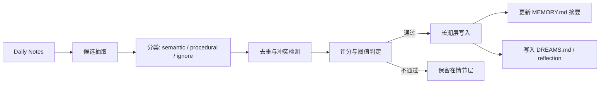

下面给你一版适合团队评审的《[OpenClaw](https://docs.openclaw.ai/concepts/memory) 记忆系统技术设计文档》。我按**目标、架构、模块职责、数据流、风险点**来组织，并尽量写成可直接拿去评审会讨论的格式。

---

# 《[OpenClaw](https://docs.openclaw.ai/concepts/memory) 记忆系统技术设计文档》

**文档版本**：v1.0  
**文档类型**：技术设计 / 团队评审稿  
**目标读者**：架构师、Agent 平台研发、插件开发、应用工程团队  
**设计范围**：面向 OpenClaw 工作区内的持久化记忆、检索、巩固与治理体系  
**设计原则**：兼容原生机制、降低上下文成本、提高长期稳定召回、支持可审计演进

---

## 1. 背景与问题定义

[OpenClaw](https://docs.openclaw.ai/concepts/memory) 当前官方记忆机制以**工作区 Markdown 文件**为核心：`MEMORY.md` 表示长期记忆，`memory/YYYY-MM-DD.md` 表示每日日志，`DREAMS.md` 表示实验性的 Dreaming 输出；同时提供 `memory_search` 和 `memory_get` 用于召回与读取。这种机制的优点是透明、可编辑、可审计，但当长期信息持续堆叠在单一 `MEMORY.md` 中时，会带来上下文成本升高、结构扁平化和长期维护困难的问题。[Source](https://docs.openclaw.ai/concepts/memory)

[OpenClaw](https://docs.openclaw.ai/concepts/context) 官方明确区分了 **context** 与 **memory**：前者是每轮真正进入模型窗口的内容，后者是存储在磁盘上、之后可被重新加载的持久信息。尤其需要注意的是，`MEMORY.md` 会被注入每轮系统上下文，而 `memory/*.md` 默认不会自动注入，而是通过检索按需读取。因此，如果将全部长期知识都塞入 `MEMORY.md`，会直接推高 token 使用量并增加 compaction 压力。[Source](https://docs.openclaw.ai/concepts/context) [Source](https://docs.openclaw.ai/concepts/system-prompt)

社区对 [OpenClaw](https://github.com/openclaw/openclaw/issues/22077) 的记忆演进也给出了相似判断：仅靠“全部放上下文”或“只依赖模糊向量召回”都不够理想，更合理的做法是将记忆拆为**情节记忆、语义记忆、程序记忆**等层次，并引入专门的 curation / consolidation 过程，将原始事件提炼为更稳定的长期知识。[Source](https://github.com/openclaw/openclaw/issues/22077)

---

## 2. 设计目标

本方案的首要目标是建立一套**兼容 OpenClaw 原生机制**的增强型记忆系统，在不破坏其 Markdown + 检索基础形态的前提下，提升以下四项能力。

第一，**低成本常驻**。让真正需要“每轮都知道”的信息保留在 `MEMORY.md` 中，其余信息进入可检索但不默认注入的结构化存储层，从而降低上下文预算占用。[Source](https://docs.openclaw.ai/concepts/system-prompt)

第二，**高质量召回**。充分利用 OpenClaw 已有的 hybrid retrieval 机制，即语义向量检索与 BM25 关键词检索并行，再通过时间衰减和 MMR 做排序与去重，以提升不同类型问题下的召回精度。[Source](https://docs.openclaw.ai/concepts/memory-search)

第三，**可解释的长期沉淀**。借鉴 [Dreaming](https://docs.openclaw.ai/concepts/dreaming) 的分阶段巩固逻辑，使长期记忆的形成不依赖“即时写入”，而是经过候选抽取、评分、去重、晋升、审计等流程，保证长期层的高信噪比。[Source](https://docs.openclaw.ai/concepts/dreaming)

第四，**团队可运营**。记忆系统不仅服务模型，也要服务工程团队，因此必须具备可回溯、可审计、可归档、可修正、可逐步演进等治理属性。[Source](https://docs.openclaw.ai/concepts/memory)

---

## 3. 非目标

本方案当前**不追求**以下能力，以避免设计失焦。

一是不在第一阶段引入复杂的外部知识图谱数据库。OpenClaw 内置 memory engine 已经提供了基于 SQLite 的索引、FTS5 和向量能力，因此首期不应先构建一个完全替代原生能力的外部大系统。[Source](https://docs.openclaw.ai/concepts/memory-builtin)

二是不将“所有对话内容”都晋升为长期记忆。长期层只保留高复用、高置信、可验证的信息，避免长期存储被原始噪声污染。[Source](https://docs.openclaw.ai/concepts/dreaming)

三是不把 `DREAMS.md` 当作事实权威源。它应是巩固过程与反思摘要的审计产物，而非用户事实的最终真相库。[Source](https://docs.openclaw.ai/concepts/dreaming)

---

## 4. 设计原则

### 4.1 分层而非平铺
记忆必须区分“发生过什么”“知道什么”“下次怎么做”，而不是全部堆在一个文件中。这个原则与社区提出的 Episodic / Semantic / Procedural 分层方向一致。[Source](https://github.com/openclaw/openclaw/issues/22077)

### 4.2 总纲注入，细节按需召回
`MEMORY.md` 保持短小，只承载必须进入每轮上下文的高价值摘要；详细内容放入专门主题文件并通过 `memory_search` / `memory_get` 按需加载。[Source](https://docs.openclaw.ai/concepts/system-prompt) [Source](https://docs.openclaw.ai/concepts/memory)

### 4.3 结构化优先于纯文本堆积
对于用户偏好、项目事实、环境约束、操作 runbook 等长期信息，应使用半结构化 Markdown 模板表达，以支持关键词命中、去重和后续修订。[Source](https://github.com/openclaw/openclaw/issues/22077)

### 4.4 巩固优先于即时升格
只有经过多次出现、跨查询命中、用户确认、跨天复现或任务复用验证的信息，才应该进入长期层。该原则与 Dreaming Deep phase 的 threshold gating 一致。[Source](https://docs.openclaw.ai/concepts/dreaming)

### 4.5 可审计高于“隐式聪明”
所有长期记忆必须有来源、更新时间、置信度、修订关系，避免形成无法解释的“黑箱记忆”。[Source](https://docs.openclaw.ai/concepts/memory)

---

## 5. 总体架构

本设计采用 **4 层记忆 + 1 条巩固流水线** 的体系：

- **L0 工作记忆**：当前会话上下文、最近对话、即时工具输出  
- **L1 情节记忆**：每天发生过的事件、决策、异常、进展  
- **L2 语义记忆**：稳定事实、偏好、项目知识、实体关系  
- **L3 程序记忆**：runbook、经验规则、失败复盘、操作方法  
- **L4 反思巩固层**：Dreaming / daily / weekly consolidation 的审计与摘要层

这一层次化设计与 OpenClaw 原生的 `MEMORY.md + daily notes + hybrid search + Dreaming` 机制兼容，只是在其上补充了更明确的存储边界与治理流程。[Source](https://docs.openclaw.ai/concepts/memory) [Source](https://docs.openclaw.ai/concepts/memory-search) [Source](https://docs.openclaw.ai/concepts/dreaming)

### 5.1 架构图



---

## 6. 存储结构设计

建议的工作区结构如下：

```text
workspace/
├─ MEMORY.md
├─ DREAMS.md
├─ memory/
│  ├─ 2026-04-07.md
│  ├─ 2026-04-08.md
│  ├─ semantic/
│  │  ├─ user_profile.md
│  │  ├─ preferences.md
│  │  ├─ environments.md
│  │  ├─ projects/
│  │  │  └─ openclaw.md
│  │  └─ entities/
│  │     └─ postgres.md
│  ├─ procedures/
│  │  ├─ runbooks/
│  │  └─ lessons/
│  ├─ reflection/
│  │  ├─ daily/
│  │  └─ weekly/
│  └─ archive/
```

其中，`MEMORY.md` 作为**总纲记忆**保留注入上下文的高价值摘要；`memory/YYYY-MM-DD.md` 作为**情节记忆**保留原始事件流；`semantic/` 保存稳定事实；`procedures/` 保存“怎么做”；`reflection/` 保存日/周综合与记忆治理结果。[Source](https://docs.openclaw.ai/concepts/memory) [Source](https://docs.openclaw.ai/concepts/system-prompt)

OpenClaw 内置 builtin memory engine 会将 `MEMORY.md` 与 `memory/*.md` 进行 chunk 化索引，默认约 400 token 一块、80 token overlap，并将索引写入 per-agent SQLite 数据库。因此本设计将 SQLite 视为**检索索引层**，而非事实主存；事实主存仍然是 Markdown 文件。[Source](https://docs.openclaw.ai/concepts/memory-builtin)

---

## 7. 模块职责

### 7.1 Context Adapter
负责管理会话级上下文与“该轮需要注入什么”。它不保存长期记忆，只负责把当前问题转化为检索需求，并在召回完成后将结果注入本轮上下文。其设计依据来自 OpenClaw 对 context 组装方式的说明：系统 prompt、历史消息、工具结果、注入文件共同组成当前窗口内容。[Source](https://docs.openclaw.ai/concepts/context)

**职责：**
- 识别当前上下文预算
- 决定是否仅使用 `MEMORY.md` 摘要
- 决定是否触发额外记忆检索
- 对检索结果做 token 裁剪与注入

---

### 7.2 Episodic Writer
负责把有价值的会话事件写入 `memory/YYYY-MM-DD.md`。该模块是原始记忆采集入口，不做深度抽象，只负责忠实记录“发生了什么”。这与 OpenClaw daily notes 的定位一致。[Source](https://docs.openclaw.ai/concepts/memory)

**职责：**
- 记录用户需求、系统动作、关键结果、异常与决策
- 记录时间戳、项目名、对象、来源
- 按天归档，默认 append-only
- 为后续 consolidation 提供原始素材

---

### 7.3 Semantic Memory Manager
负责管理长期稳定事实，如用户偏好、项目状态、实体关系、环境约束等。这些内容不应完全依赖向量语义召回，而应以结构化文档形式维护，以提高精确命中和修订效率。[Source](https://github.com/openclaw/openclaw/issues/22077)

**职责：**
- 存储稳定事实
- 合并重复条目
- 标记置信度与来源
- 维护项目、用户、实体主题文件

---

### 7.4 Procedural Memory Manager
负责管理“怎么做”的知识，包括操作 runbook、故障排查路径、 lessons learned。它是降低重复犯错概率的关键模块。[Source](https://github.com/openclaw/openclaw/issues/22077)

**职责：**
- 记录操作模板
- 记录故障复盘和经验
- 维护验证状态与适用条件
- 输出可复用的 SOP / runbook

---

### 7.5 Memory Retrieval Orchestrator
负责基于问题意图来决定检索哪些层、使用何种权重、如何重排结果。其底层依赖 OpenClaw 的 `memory_search` 混合检索能力，即向量检索与 BM25 并行融合，并可选配时间衰减与 MMR 去重。[Source](https://docs.openclaw.ai/concepts/memory-search)

**职责：**
- 查询意图分类
- 分层检索策略选择
- hybrid score 融合
- 结果重排与去重
- 上下文注入输出

---

### 7.6 Consolidation Engine
负责 daily / weekly / dreaming 流水线，将原始情节记忆中的高价值候选提升为长期语义记忆或程序记忆。它参考 OpenClaw Dreaming 的 Light / REM / Deep 机制，但在工程上做成更显式的可运营模块。[Source](https://docs.openclaw.ai/concepts/dreaming)

**职责：**
- 候选抽取
- 分类、去重、冲突解析
- 晋升决策
- 更新 `MEMORY.md` 摘要
- 写入 `DREAMS.md` 或 `reflection/*`

---

### 7.7 Memory Governance & Audit
负责风险控制和可审计性，不直接参与召回，但决定长期存储能否被信任。

**职责：**
- 维护 source refs / patch history
- 提供归档、降级、回滚
- 提供低置信条目清理
- 检查敏感信息进入长期层的风险

---

## 8. 数据模型设计

推荐所有长期记忆文件使用统一 frontmatter，以支持检索、去重、修订和治理。

```md
---
id: proj_openclaw_memory
type: semantic.project
title: OpenClaw Memory Redesign
status: active
confidence: 0.88
sources:
  - memory/2026-04-07.md#10:20
last_verified_at: 2026-04-07
last_used_at: 2026-04-07
tags: [openclaw, memory, architecture]
supersedes: []
---

## Facts
- Goal: redesign memory into layered architecture
- Constraint: keep MEMORY.md concise
- Retrieval: hybrid search with reranking
```

### 8.1 核心字段

| 字段 | 含义 |
|---|---|
| `id` | 唯一标识 |
| `type` | 记忆类型，如 `semantic.project` / `procedural.runbook` |
| `status` | active / archived / superseded |
| `confidence` | 置信度 |
| `sources` | 来源引用 |
| `last_verified_at` | 最近确认时间 |
| `last_used_at` | 最近召回时间 |
| `tags` | 标签 |
| `supersedes` | 被替代关系 |

这类半结构化表达方式能更好适应 BM25 精确匹配、冲突检测和人工审核需求，也符合社区对“structured semantic memory”优于纯 embedding 记忆的建议。[Source](https://github.com/openclaw/openclaw/issues/22077)

---

## 9. 核心数据流

## 9.1 写入数据流

### 流程说明
用户输入、工具结果、会话决策进入工作记忆后，经由 Episodic Writer 写入当天 daily note。随后 Consolidation Engine 从 daily note 中抽取候选项，判断其是否属于稳定事实、程序经验或仅保留在事件层；若满足晋升阈值，则写入对应的 semantic / procedural 文件，并按需刷新 `MEMORY.md` 摘要。[Source](https://docs.openclaw.ai/concepts/memory) [Source](https://docs.openclaw.ai/concepts/dreaming)

### 写入流图



---

## 9.2 查询数据流

### 流程说明
当用户提出问题时，系统先做意图识别，判断它更像是“偏好/事实/过程/近期进展/错误排查”中的哪一类，再选择对应层进行检索。底层检索依赖 OpenClaw hybrid search：向量检索负责语义相似，BM25 负责 ID、错误码、配置项等精确词命中；在大规模历史下，还可叠加时间衰减和 MMR 提升结果质量。[Source](https://docs.openclaw.ai/concepts/memory-search)

### 检索流图



---

## 9.3 巩固数据流

### 流程说明
巩固流程分为日级和周级。日级巩固关注“今天哪些内容值得长期保留”，周级巩固关注“哪些主题出现了重复模式、是否应转化为 runbook、哪些旧记忆应归档”。这与 Dreaming 的 light / REM / deep 分工方向相同：Light 做整理，REM 做反思，Deep 做晋升。[Source](https://docs.openclaw.ai/concepts/dreaming)

### 巩固流图



---

## 10. 检索策略设计

### 10.1 意图分类

| 问题类型 | 首选层 | 次选层 | 说明 |
|---|---|---|---|
| 用户偏好 / 稳定事实 | `MEMORY.md` + semantic | daily notes | 高价值固定信息优先 |
| 项目事实 | semantic/projects | daily notes | 避免回放整段历史 |
| 操作方法 / 故障修复 | procedures/runbooks | lessons | “怎么做”优先 |
| 最近进展 | daily notes | reflection | 时间线优先 |
| 报错 / 配置键 / ID | BM25-heavy hybrid | vector | 精确命中优先 |
| 模糊语义问题 | vector-heavy hybrid | semantic | 概念召回优先 |

该策略建立在 OpenClaw 现有 hybrid retrieval 能力之上，但在上层增加“问题类型感知”的编排逻辑，从而让不同问题命中更合适的记忆层。[Source](https://docs.openclaw.ai/concepts/memory-search)

### 10.2 推荐权重

- 一般事实问答：Vector 0.55 / BM25 0.45  
- 配置键、ID、报错：Vector 0.25 / BM25 0.75  
- 人物关系、偏好、主题：Vector 0.65 / BM25 0.35  

### 10.3 时效策略
OpenClaw 官方支持 temporal decay，默认思路是旧笔记随时间降权，但 `MEMORY.md` 这类 evergreen 内容不衰减。该能力适合作为 L1/L2/L3 不同层的排序增强项。[Source](https://docs.openclaw.ai/concepts/memory-search)

建议参数：
- episodic：14~30 天半衰期
- semantic：180 天或不衰减
- procedural：按“最后验证时间”而非创建时间衰减

---

## 11. `MEMORY.md` 设计规范

`MEMORY.md` 在 OpenClaw 中会自动进入每轮上下文，因此必须严格控制体积与内容密度。官方也明确建议保持其简洁，否则会带来高上下文消耗和更频繁 compaction。[Source](https://docs.openclaw.ai/concepts/system-prompt)

### 推荐内容
- 用户长期偏好
- 当前活跃项目摘要
- 高优先级运行规则
- 对详细主题文件的导航链接或引用

### 不建议内容
- 完整历史事件
- 大段原始对话
- 未验证的候选事实
- 长篇 runbook 细节

### 示例结构
```md
# Core Identity
- User prefers Chinese responses.
- User values concise architecture documents.

# Active Projects
- OpenClaw memory redesign → see memory/semantic/projects/openclaw.md

# Stable Preferences
- Prefer explicit structure over opaque vector-only recall.

# Rules
- Keep MEMORY.md concise.
- Store details in semantic/* and procedures/*.
```

---

## 12. 冲突处理与遗忘策略

长期记忆系统不仅要会“记住”，还要会“修正”和“降级”。

### 12.1 冲突优先级

| 优先级 | 规则 |
|---|---|
| P1 | 用户明确更正 > 系统推断 |
| P2 | 新版本 > 旧版本 |
| P3 | 多次复现 > 单次事件 |
| P4 | 已验证 runbook > 临时经验 |
| P5 | 稳定主题文件 > 未整理 daily note |

### 12.2 遗忘/归档策略

| 情况 | 动作 |
|---|---|
| 临时任务细节过期 | 归档到 `archive/` |
| 项目结束 | 语义记忆转 archived |
| runbook 被新方案替代 | 标记 `superseded` |
| 低置信长期未命中条目 | 降权或移除 |
| 疑似敏感信息 | 审计后删除或脱敏 |

这一策略与 Dreaming 中“不是所有短期信号都值得长期晋升”的机制一致，长期层应追求高信噪比。[Source](https://docs.openclaw.ai/concepts/dreaming)

---

## 13. 模块接口建议

### 13.1 写入接口
```ts
remember({
  content,
  kind: "episodic" | "semantic" | "procedural",
  scope: "user" | "project" | "system",
  metadata
})
```

### 13.2 召回接口
```ts
recall({
  query,
  intent,      // fact / preference / procedure / recent_activity / error_lookup
  scope,
  topK,
  recencyBias,
  exactMatchBoost
})
```

### 13.3 巩固接口
```ts
consolidate({
  mode: "daily" | "weekly",
  dryRun: boolean
})
```

### 13.4 修正接口
```ts
revise({
  memoryId,
  patch,
  reason
})
```

### 13.5 遗忘接口
```ts
forget({
  criteria,
  mode: "archive" | "delete" | "demote"
})
```

这类 API 设计可视为对社区提出的 `remember / recall / forget` 抽象的工程化扩展，补足了 consolidation 与 revise 两类在真实系统中不可缺失的动作。[Source](https://github.com/openclaw/openclaw/issues/22077)

---

## 14. 可观测性与治理

### 14.1 核心指标

| 指标 | 说明 |
|---|---|
| Recall Hit Rate | 用户问题是否命中正确记忆 |
| Precision@K | Top-K 结果是否足够精确 |
| Long-term Promotion Rate | 日志进入长期层比例 |
| Memory Drift Rate | 长期事实被修正频率 |
| Context Cost | 每轮由记忆带来的 token 占用 |
| Stale Memory Rate | 长期未命中、长期未验证比例 |

### 14.2 运营看板建议
- 活跃项目数
- 长期记忆总量
- 近 7 天晋升条数
- 最近被修正的记忆
- 低置信候选池
- Top 命中主题
- 每轮 `MEMORY.md` 注入长度

这类可观测性尤其重要，因为 OpenClaw context 本身是有限资源，而 `/context` 系列能力也表明“注入了什么、占了多少”是系统质量管理的关键视角。[Source](https://docs.openclaw.ai/concepts/context)

---

## 15. 主要风险点与缓解措施

### 15.1 风险一：`MEMORY.md` 膨胀导致上下文成本失控
如果长期事实、运行细节、历史摘要全都写入 `MEMORY.md`，将直接增加每轮 prompt 成本并加快 compaction 发生频率。OpenClaw 官方已明确提示应保持 `MEMORY.md` 简洁。[Source](https://docs.openclaw.ai/concepts/system-prompt)

**缓解措施：**
- `MEMORY.md` 只保留总纲
- 详细事实下沉到 `semantic/*`
- 对 `MEMORY.md` 设字数与条目上限
- 每周自动压缩摘要

---

### 15.2 风险二：长期层被噪声污染
如果即时事件未经筛选直接写入长期层，会导致错误事实、临时偏好和偶然经验长期残留。Dreaming 的设计已经说明，长期晋升必须有阈值与多信号加权。[Source](https://docs.openclaw.ai/concepts/dreaming)

**缓解措施：**
- 引入 daily / weekly consolidation
- 置信度、来源数、跨天复现作为门槛
- 未验证信息不写入 semantic/procedural
- 提供 revise / archive 机制

---

### 15.3 风险三：召回命中不稳定
纯向量召回可能对配置项、错误码、ID、符号名不稳定，而纯关键词召回又可能遗漏语义相近表达。OpenClaw 的官方方案就是将向量与 BM25 并行融合。[Source](https://docs.openclaw.ai/concepts/memory-search)

**缓解措施：**
- 保留 hybrid search 为底层标准
- 对报错和配置键设置 BM25 boost
- 开启 MMR 降低冗余
- 引入 query intent-aware rerank

---

### 15.4 风险四：程序记忆失真
runbook 如果长期未验证，可能会随环境变化而过期，导致 agent 复用错误方法。

**缓解措施：**
- 程序记忆增加 `last_verified_at`
- 按验证时间衰减
- 每次成功执行后刷新状态
- 对过期 runbook 自动标记 review needed

---

### 15.5 风险五：敏感信息进入长期层
用户隐私、密钥、内部标识符若被无意识写入长期记忆，会扩大泄漏面。

**缓解措施：**
- 写入前做敏感字段检测
- source-aware redaction
- 长期层仅保留必要摘要，明文敏感值不进入 `MEMORY.md`
- 审计模块支持回滚与删除

---

### 15.6 风险六：多文件结构带来维护复杂度上升
分层后文件更多，若缺少统一模板和规则，反而会出现检索入口混乱、重复存储和维护分散的问题。

**缓解措施：**
- 统一 frontmatter 模板
- 统一命名规则与目录协议
- 在 `MEMORY.md` 中保留“活跃主题索引”
- 定期运行冲突与重复扫描

---

## 16. 实施路线

### Phase 1：MVP
- 保留原生 `MEMORY.md + daily notes`
- 增加 `semantic/` 与 `procedures/`
- 增加 daily consolidation job
- 制定统一模板与命名规则

### Phase 2：检索增强
- 增加 intent classifier
- 增加 source-aware rerank
- 增加层级召回策略
- 增加上下文预算控制

### Phase 3：治理增强
- 增加 weekly synthesis
- 增加 revise / archive / supersede
- 增加低置信候选池
- 增加可观测性 dashboard

### Phase 4：高级能力
- 评估跨 agent 共享记忆
- 评估实体图谱/关系推理
- 评估更强 reranker 或 query expansion
- 评估外部 memory plugin 扩展

这一演进路线与 OpenClaw 当前插件化 memory slot、builtin engine 和 Dreaming 机制兼容，适合渐进落地，而不是一次性大改。[Source](https://docs.openclaw.ai/concepts/memory-builtin) [Source](https://docs.openclaw.ai/concepts/dreaming)

---

## 17. 结论

本设计的核心结论是：

**[OpenClaw](https://docs.openclaw.ai/concepts/memory) 的最佳记忆演进方向，不是抛弃其“Markdown + 检索”的原生形态，而是在此基础上建立“总纲注入 + 分层存储 + 混合检索 + 周期巩固 + 审计治理”的体系。**  
其中，`MEMORY.md` 只承担高价值摘要，daily notes 承担原始事件流，`semantic/` 承担长期事实，`procedures/` 承担操作经验，`DREAMS.md / reflection/` 承担巩固与审计；检索层则继续以 OpenClaw 官方 hybrid search 为基础，并在上层增加问题意图编排与重排策略。[Source](https://docs.openclaw.ai/concepts/memory) [Source](https://docs.openclaw.ai/concepts/memory-search) [Source](https://docs.openclaw.ai/concepts/system-prompt) [Source](https://docs.openclaw.ai/concepts/dreaming)

---

如果你愿意，我下一步可以继续补两样最适合评审会使用的配套材料：

**A.《技术方案附录》**：包含目录规范、frontmatter 模板、API 伪代码、评分规则  
**B.《评审汇报版》**：把上面这份文档压缩成 8 页左右的评审提纲/汇报稿

你直接回一句：  
**“继续，给我评审汇报版”**  
或者  
**“继续，给我技术方案附录”**

