# GClaw 系统架构设计

**Date:** 2026-04-02
**Version:** 0.1.0
**Status:** MVP Completed

---

## 1. 系统总览

GClaw 采用**模块化单体架构**（Modular Monolith），基于 Next.js 15 App Router 统一承载前端 UI 和后端 API。整体分为四个垂直层次：

```mermaid
graph TB
    subgraph "客户端层 (Browser)"
        UI["Web UI<br/>React 19 + Tailwind"]
        IM["IM 渠道<br/>钉钉 / 飞书 / 微信"]
    end

    subgraph "API 网关层 (Next.js API Routes)"
        ChatAPI["/api/chat/*<br/>SSE 流式对话"]
        ChannelAPI["/api/channels/*<br/>Webhook + SSE"]
        ProjectAPI["/api/projects<br/>项目管理"]
        SkillAPI["/api/skills/*<br/>技能管理"]
        SettingsAPI["/api/settings<br/>设置管理"]
        AgentAPI["/api/agents<br/>智能体管理"]
    end

    subgraph "核心服务层 (lib/claude)"
        PM["ProcessManager<br/>SDK 调度 + 进程管理"]
        SP["StreamParser<br/>SDKMessage → ParsedEvent"]
        SH["SkillHooks<br/>声明式 Hook 系统"]
        SD["SkillsDir<br/>技能目录管理"]
        CM["ClaudeMd<br/>项目 CLAUDE.md 生成"]
        EB["EventBus<br/>全局事件总线"]
    end

    subgraph "持久化层 (data/)"
        FS["文件系统 JSON<br/>projects.json<br/>messages.json<br/>settings.json"]
        Skills["技能库<br/>skills/*"]
    end

    subgraph "外部服务"
        Claude["Claude API<br/>(Agent SDK)"]
        DT["钉钉开放平台"]
        FS_L["飞书开放平台"]
        WX["微信 ClawBot"]
    end

    UI -->|SSE| ChatAPI
    UI -->|REST| ProjectAPI
    UI -->|REST| SkillAPI
    UI -->|REST| SettingsAPI
    UI -->|REST| AgentAPI
    UI -->|SSE| ChannelAPI

    IM -->|Webhook| ChannelAPI

    ChatAPI --> PM
    ChannelAPI --> CS["ChannelService"] --> PM

    PM -->|query()| Claude
    PM --> SP
    PM --> SH
    PM --> SD
    PM --> CM
    SH --> EB

    PM --> FS
    ChannelAPI --> FS

    ChannelAPI -.->|认证| DT
    ChannelAPI -.->|认证| FS_L
    ChannelAPI -.->|认证| WX
```

---

## 2. 核心数据流

### 2.1 Web UI 对话流程

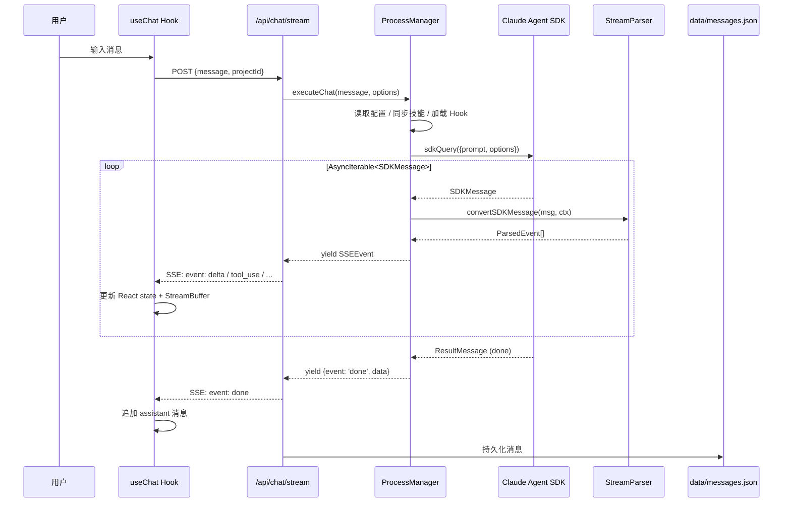

### 2.2 渠道消息处理流程

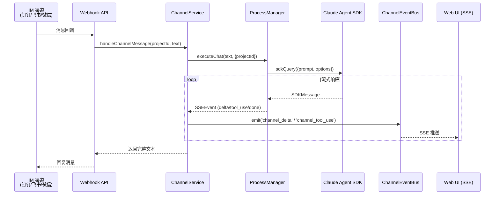

### 2.3 权限审批流程

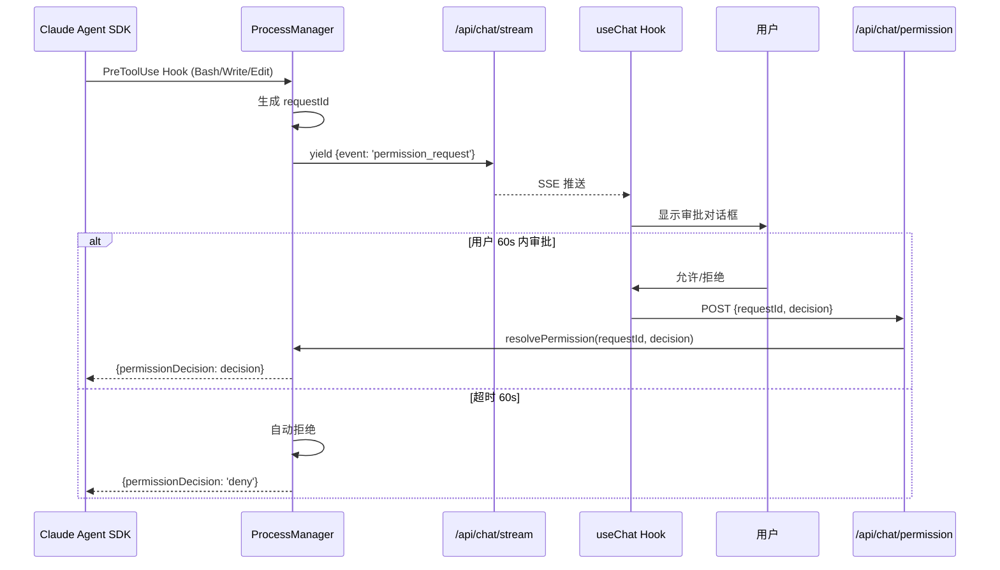

---

## 3. 组件架构

### 3.1 前端组件树

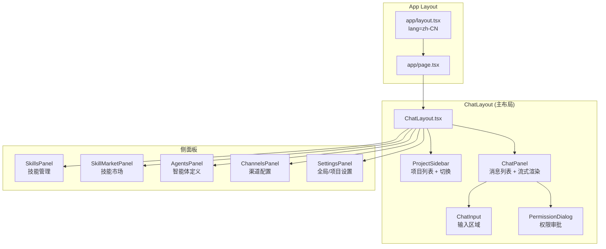

### 3.2 前端状态管理

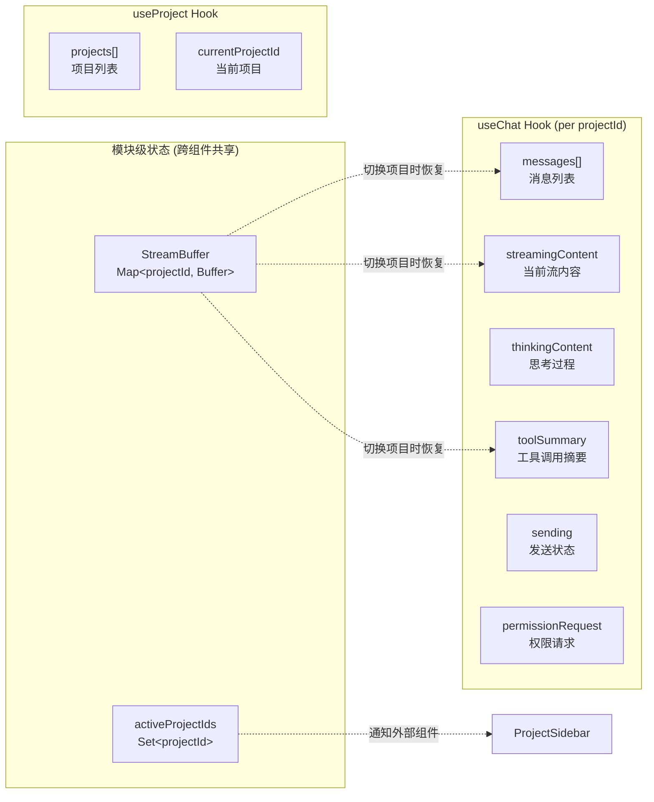

**关键设计：StreamBuffer 机制**
- 模块级 `Map<projectId, StreamBuffer>` 存储每个项目的流状态
- 切换项目时从 buffer 恢复 React state，后台流不中断
- `pendingMessages[]` 收集离线期间产生的消息，切回时合并

---

## 4. 后端模块架构

### 4.1 Claude SDK 集成层

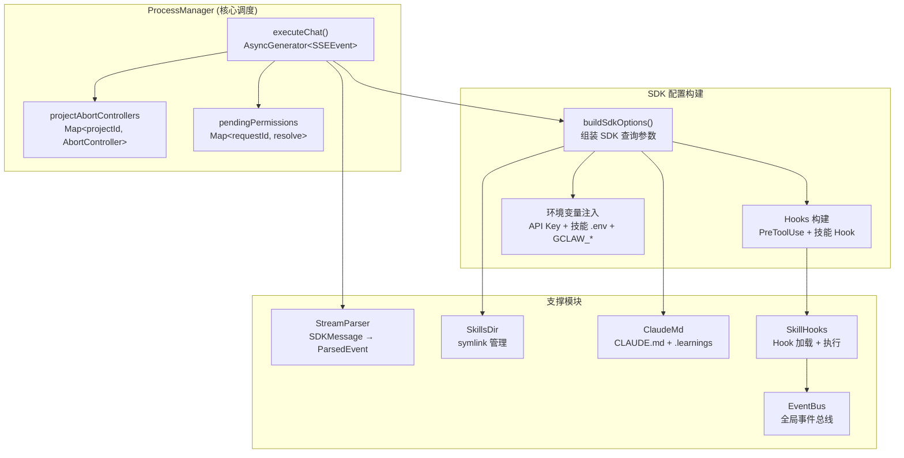

**ProcessManager 核心职责：**
1. 管理 `AbortController` 生命周期（per-project 隔离）
2. 构建 SDK `query()` 参数（model、hooks、env、agents）
3. 迭代 `AsyncIterable<SDKMessage>`，通过 StreamParser 转换
4. 将 `ParsedEvent` 映射为 `SSEEvent` yield 给 API 层
5. Session 失效时自动重试（清除 sessionId 后重新查询）

### 4.2 事件总线

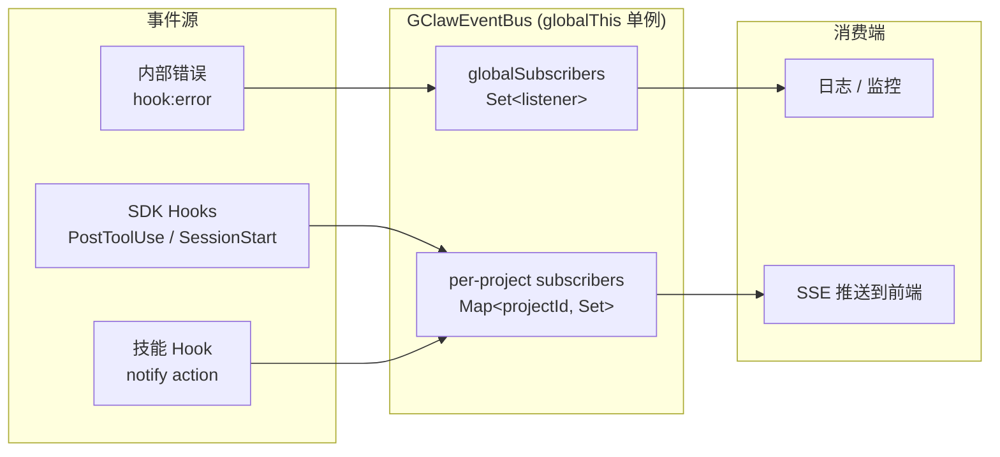

**事件类型：**

| 类型 | 触发场景 | 数据 |
|------|---------|------|
| `tool:success` | PostToolUse | toolName, toolInput, toolResponse |
| `tool:failure` | PostToolUseFailure | toolName, error |
| `session:start` | SessionStart | sessionId |
| `session:end` | SessionEnd | — |
| `skill:notify` | 技能自定义 | message, hookEvent |
| `hook:error` | Hook 执行异常 | error, hookEvent |

### 4.3 技能 Hook 系统

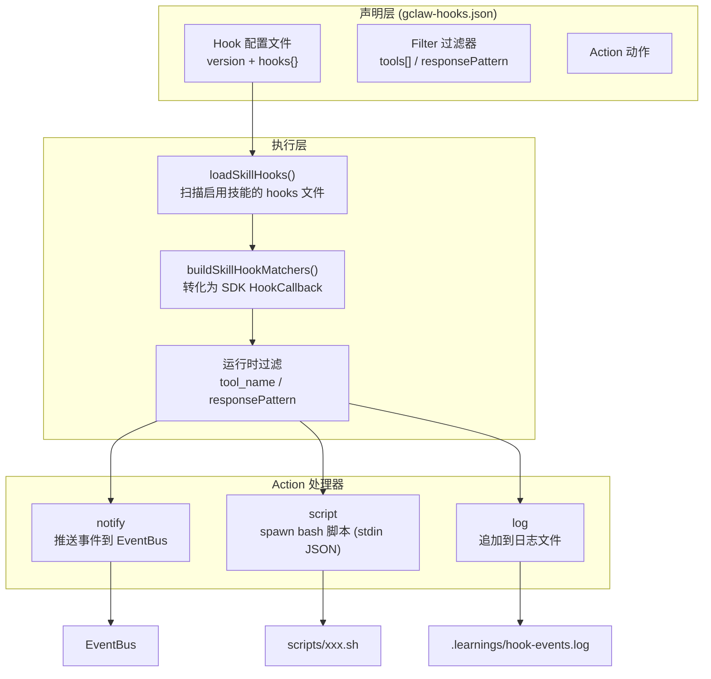

**Hook 生命周期：**
1. `loadSkillHooks()` — 扫描启用技能的 `gclaw-hooks.json`
2. `buildSkillHookMatchers()` — 转为 SDK `HookCallback` 格式
3. 注入 `buildSdkOptions().hooks`
4. SDK 触发事件 → Filter 过滤 → 执行 Action
5. `notify` / `script` 可返回 `systemMessage` 注入 Agent 上下文

### 4.4 渠道集成

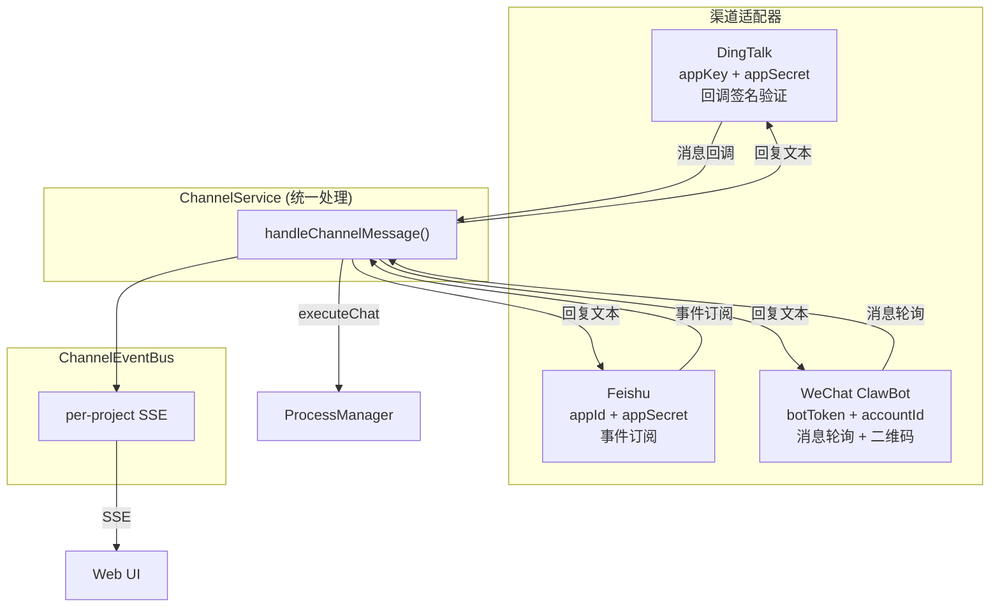

---

## 5. 数据模型

### 5.1 持久化结构

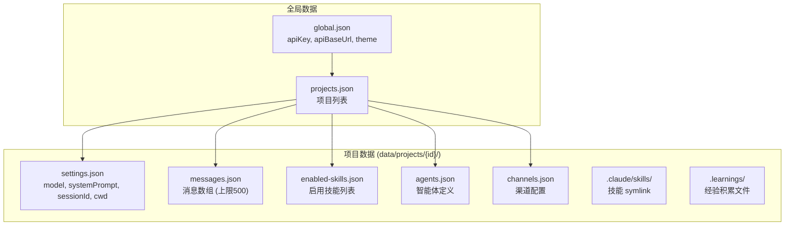

### 5.2 核心类型

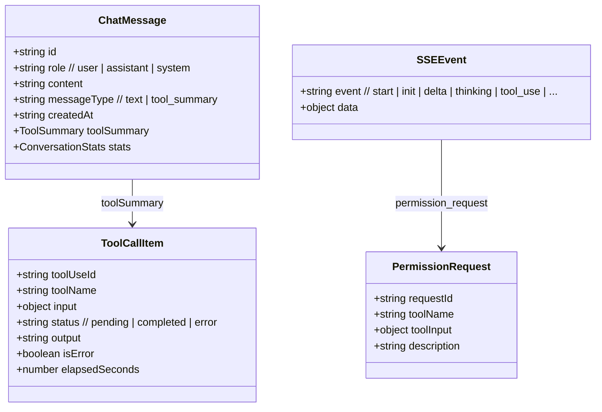

---

## 6. API 路由架构

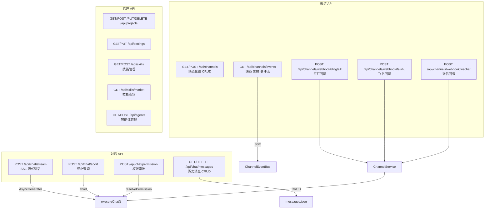

---

## 7. 多项目并发模型

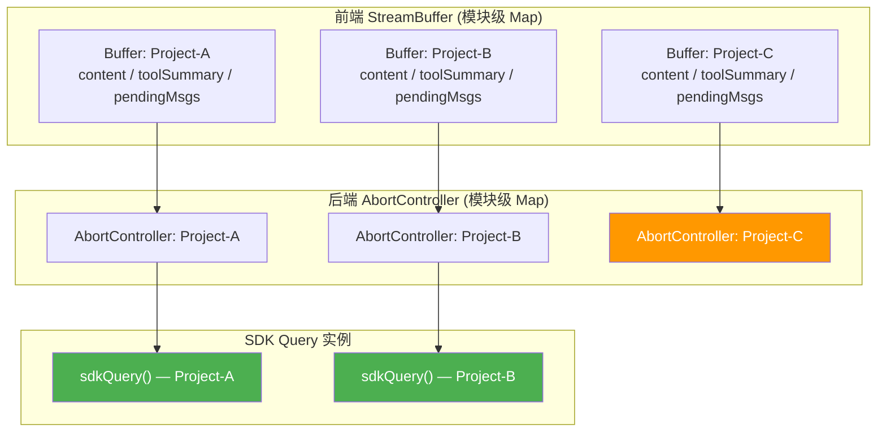

**并发规则：**
- 每个项目独立的 `AbortController`，同一项目新查询会 abort 旧查询
- 前端 `StreamBuffer` 缓存每个项目的流状态，切换项目时恢复
- 后台项目的流继续运行，`pendingMessages` 收集离线消息
- `activeProjectIds` Set 追踪所有活跃项目，供 Sidebar 显示状态

---

## 8. 技术栈总览

| 层次 | 技术 | 版本 | 说明 |
|------|------|------|------|
| **前端框架** | Next.js (App Router) | 15 | SSR/SSG + API Routes |
| **UI 库** | React + Tailwind CSS | 19 + 3.4 | 组件化 + CSS 变量主题 |
| **AI SDK** | claude-agent-sdk | 0.1.76 | 原生 Agent 调用 |
| **实时通信** | SSE (Server-Sent Events) | — | 双路 SSE（对话 + 渠道） |
| **持久化** | 文件系统 JSON | — | data/ 目录，零配置 |
| **语言** | TypeScript (strict) | 5.x | 全栈类型安全 |
| **图标** | lucide-react | — | 轻量图标库 |
| **Markdown** | react-markdown + remark-gfm | — | 消息渲染 |

---

## 9. 关键设计决策

| 决策 | 选择 | 原因 | 权衡 |
|------|------|------|------|
| 架构模式 | 模块化单体 | Level 2 项目复杂度，单团队开发 | 未来可拆分为微服务 |
| 实时通信 | SSE 而非 WebSocket | 单向推送为主，实现简单，HTTP 兼容好 | 不支持双向通信 |
| 持久化 | 文件系统 JSON | 零配置部署，快速上线 | 不适合高并发/大数据量 |
| SDK 调用 | AsyncGenerator | 天然支持流式迭代，内存友好 | 错误处理稍复杂 |
| 事件总线 | globalThis 单例 | 防止 HMR 热替换丢失状态 | 不支持多进程 |
| 权限机制 | bypassPermissions + PreToolUse Hook | 自定义审批 UI，绕过 SDK 内置权限 | 需自行维护安全逻辑 |
| 技能管理 | symlink 到项目 .claude/skills/ | SDK 自动扫描 .claude/skills/ 目录 | 需定期清理失效链接 |

---

**Document Status:** Complete
**Last Updated:** 2026-04-02
